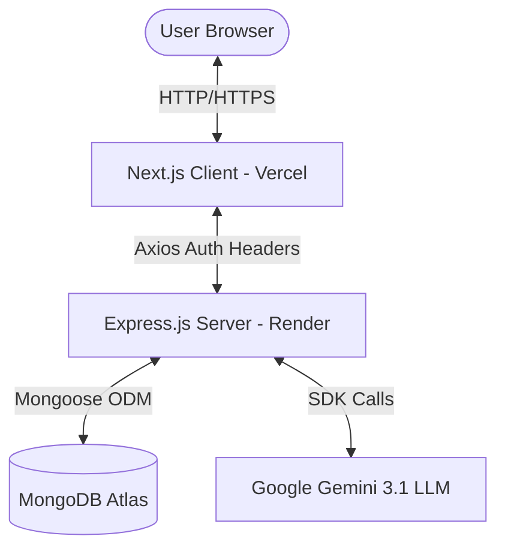

# AI Notes 🧠✨

A premium, cinematic, AI-augmented workspace for note-taking, intellectual organization, and real-time document reasoning. Powered by **Google Gemini API**, it provides live context analysis, auto-categorization, title suggestions, and structural insights.

---

## 🚀 Live Environment

- **Frontend Interface:** [Vercel Deployment](https://ai-notes-seven-iota.vercel.app/)
- **Backend API Gateway:** [Render Gateway](https://ai-notes-h9au.onrender.com)

---

## 🏛️ System Architecture

The project is structured as a decoupled monorepo comprising a Next.js client application and an Express.js backend server.



### 1. Frontend Core Layout (`client/`)
- **Routing Engine:** Built on **Next.js App Router** with nested dynamic groups (`(dashboard)`, `(auth)`).
- **Global State & Caching:** Powered by **TanStack Query (React Query)** to handle data fetching, stale-time caching, and optimistic UI invalidation.
- **Dynamic Interceptor Network:** An Axios-based request interceptor binds standard **Stateless JWT Authorization Headers** (`Authorization: Bearer <token>`) to outgoing API requests to guarantee protection against cross-site browser cookie policies.
- **Aesthetic DNA:** Designed in dark orange, white, and deep obsidian tones, utilizing HSL glowing layers, custom animated inputs, glassmorphic panels, and Lucide icons.

### 2. Backend Gateway (`server/`)
- **API Engine:** Written in **Node.js** & **Express** adopting a structured Model-Service-Controller MVC design pattern.
- **Object Modeling:** Managed with **Mongoose ODM** mapping onto a MongoDB Atlas database.
- **Authentication:** Token-based authentication using **jsonwebtoken** and cryptographic hashing (`bcryptjs`).
- **AI Processing Pipeline:** Communicates with `gemini-3.1-flash-lite` via `@google/generative-ai`.
- **Response Caching:** Built-in in-memory caching system (`Map` based with TTL and LRU expiration) to minimize LLM token usage and prevent API rate-limits on redundant requests.

---

## ⚙️ Local Development Setup

Follow these steps to spin up the entire application on your system:

### 📋 Prerequisites
- **Node.js** (v18.x or higher)
- **npm** (v9.x or higher)
- **MongoDB** (Local instance or free Atlas cluster URI)
- **Gemini API Key** (Get one from [Google AI Studio](https://aistudio.google.com/))

---

### 1. Backend Server Setup
Navigate to the `server/` directory and configure the engine:

```bash
cd server
npm install
```

#### Environment Configuration
Create a `.env` file in the `server/` directory (you can copy the provided `.env.example` as a starting point):

```bash
# Copy template
cp .env.example .env
```

Define the variables in your `.env`:
```env
PORT=5000
NODE_ENV=development
MONGO_URI=your_mongodb_connection_string
JWT_SECRET=any_random_cryptographic_string_here
JWT_EXPIRE=30d
JWT_COOKIE_EXPIRE=30
GEMINI_API_KEY=your_gemini_api_key_here
CLIENT_URL=http://localhost:3000
```

#### Start Server
```bash
npm run dev
```
The server will boot up locally at **`http://localhost:5000`**.

---

### 2. Frontend Client Setup
Navigate to the `client/` directory and spin up the user interface:

```bash
cd ../client
npm install
```

#### Environment Configuration
Create a `.env.local` file inside the `client/` directory:

```env
NEXT_PUBLIC_API_URL=http://localhost:5000/api
```

#### Start Client
```bash
npm run dev
```
The interface will compile and run at **`http://localhost:3000`**.

---

## 🧠 Core Features Walkthrough

### 🔍 Advanced Search & Tag/Category Filtering
- **Fuzzy Search:** Type titles or key sentences to filter notes instantaneously using debounced API triggers.
- **AI-Categorized Dropdowns:** Filter thoughts based on **Tags** or **AI-generated Categories** (`Technology`, `Finance`, `Creative`, etc.) dynamically extracted by the AI Engine.
- **One-Click Reset:** Quickly reset selected filters using an elegant interface control.

### ⚡ Smart AI Sidepanel Tools
- **Suggest Title:** Scans note content and offers 6-word title proposals that update automatically in the editor and database.
- **Summarize & Tasks:** Compiles bulleted key insights or parses items into interactive checklists.
- **Insights Tool:** Determines the note's reading time, sentiment score, complexity, and primary category.
- **Auto Tags:** Inspects contents and attaches relevant metadata keywords.

### 📝 Auto-Save Architecture
- Changes to note title, content, or tags are debounced and automatically patched to the database behind the scenes, featuring save status indicators ("Saving...", "Saved", "Error").