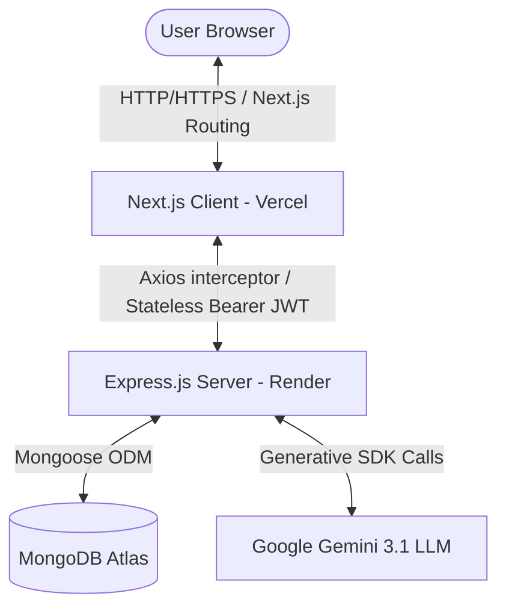
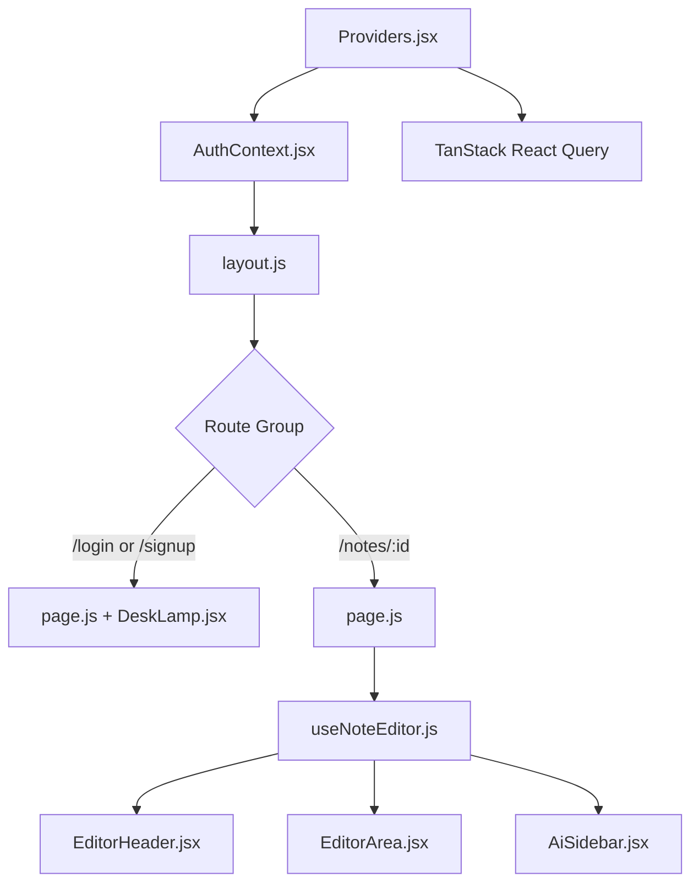
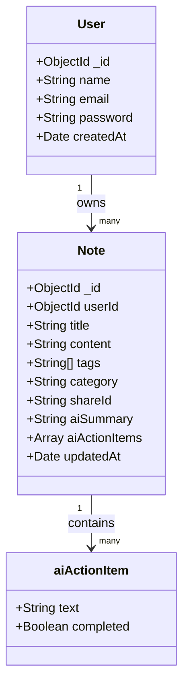
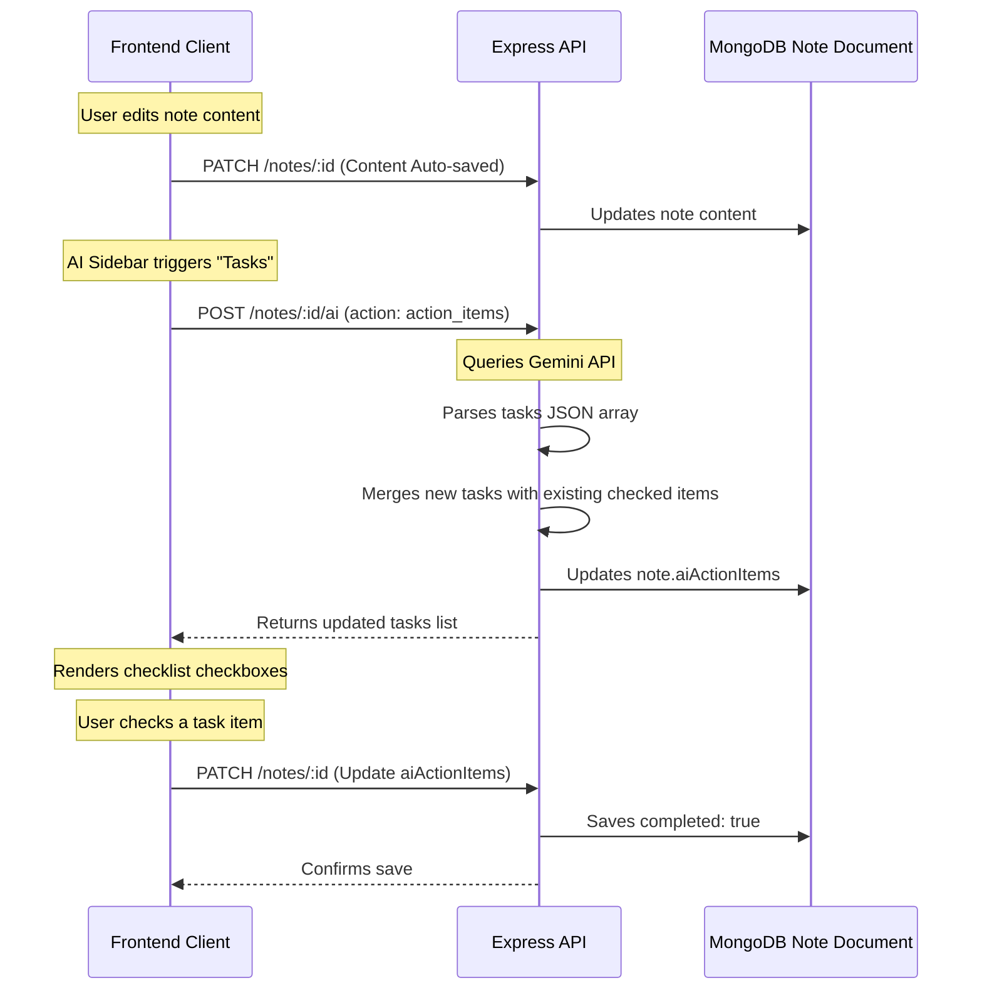

# NeuralDesk Codebase Masterclass: Architecture, Logic, and Data Flows

Welcome to the **NeuralDesk Developer-Level Codebase Masterclass**. This document provides an exhaustive, end-to-end breakdown of the NeuralDesk monorepo. It is designed to take you from a high-level architectural understanding to the fine-grained implementation details of every major system.

---

# 1. Monorepo System Architecture

NeuralDesk is structured as a decoupled monorepo containing a frontend client and a backend API gateway:



### Decoupled Monorepo Structure

The project root splits clean execution concerns between:
1. **`client/`**: A Next.js (App Router) client application utilizing TailwindCSS for UI layouts, GSAP for animations, React Query for server state management, and the Web Audio API for browser sound synthesis.
2. **`server/`**: A Node.js + Express backend service coordinating Mongoose schemas (MongoDB Atlas), JWT authentication, request validation, in-memory cache layers, and the Google Gemini AI pipeline.

---

# 2. Project Folder Structure

Below is the directory map of the codebase, detailing the purpose of each file and folder:

### Root Level
- **`package.json`**: Standard root description file for repository definitions.
- **`README.md`**: Main project entrance overview, architecture documentation, and setup guides.
- **`.gitignore`**: Production-ready root configuration ensuring node modules, next build files, local logs, and environment variables are not committed.
- **`samples/`**: Contains raw JSON snapshots of database documents and API payloads to help visualize schema shapes.

---

### Client Application (`client/`)

```
client/
├── public/                 # Static assets (images, logos)
├── src/
│   ├── app/                # Next.js App Router routes & layouts
│   │   ├── (auth)/         # Login & Signup routes
│   │   ├── (dashboard)/    # Dashboard, Notes List, and Note Editor
│   │   ├── shared/         # Public note-sharing routes
│   │   ├── globals.css     # Tailwind styling rules and custom theme utilities
│   │   ├── layout.js       # App-wide root viewport provider wrapper
│   │   └── page.js         # Interactive marketing landing page
│   ├── components/         # Reusable React components
│   │   ├── Dashboard/      # RecentNoteItem.jsx, StatsCard.jsx
│   │   ├── NoteEditor/     # AiSidebar.jsx, EditorArea.jsx, EditorHeader.jsx
│   │   ├── ui/             # Inline customized Tailwind configurations
│   │   ├── DeskLamp.jsx    # SVG Interactive Desk Lamp (GSAP & Web Audio)
│   │   ├── Providers.jsx   # React Query, AuthContext, & Toast wrappers
│   │   └── DeleteConfirmModal.jsx
│   ├── context/
│   │   └── AuthContext.jsx # Global user sign-in/sign-out hook provider
│   ├── hooks/
│   │   └── useNoteEditor.js # Centralized state hook for editor & AI workflows
│   └── lib/
│       ├── axios.js        # Axios instance configured with JWT request interceptors
│       └── hooks.js        # Debounce hooks for auto-save operations
```

---

### Backend API Gateway (`server/`)

```
server/
├── src/
│   ├── app.js              # Express app initialization, middleware chains, and router bindings
│   ├── server.js           # Server runner establishing database connection and listening on port
│   ├── config/             # Environment and API prompts configurations
│   │   ├── aiPrompts.js    # Domain-adaptive generative prompt prompts
│   │   └── db.js           # Mongoose ODM MongoDB cluster configuration
│   ├── controllers/        # Request handlers resolving responses
│   │   ├── aiController.js # AI-processing routes, caching checks, and Mongoose merges
│   │   ├── authController.js # Signups, logins, and token signatures
│   │   └── noteController.js # Note CRUD, sharing links, and favorite state toggles
│   ├── middleware/         # Intermediate request layers
│   │   ├── auth.js         # Verification checks of Bearer token validation
│   │   └── error.js        # Centralized HTTP status error wrapper
│   ├── models/             # Schema structures for ODM mappings
│   │   ├── Note.js         # Note document properties, including nested aiActionItems
│   │   └── User.js         # User model storing hashed password fields
│   ├── routes/             # Path routing declarations
│   │   ├── authRoutes.js   # Paths targeting auth controllers
│   │   ├── noteRoutes.js   # Note management routing paths
│   │   └── sharedRoutes.js # Shared viewing router
│   ├── services/           # External API interactions
│   │   ├── aiService.js    # SDK integration for Google Gemini client
│   │   └── noteService.js  # Helper operations supporting note metrics
│   ├── utils/              # Helper utilities
│   │   ├── aiResponseParser.js # RegExp extractor parsing JSON out of markdown
│   │   ├── apiResponse.js  # Standard JSON response structures
│   │   ├── asyncHandler.js # Wrapper handling try/catch blocks in Express routes
│   │   └── generateToken.js# JWT signature helper
│   └── validators/         # Input validations
│       ├── authValidator.js# Signin/Signup field validation rules
│       ├── noteValidator.js# Note update validation rules
│       └── validate.js     # Middleware raising express-validator exceptions
```

---

# 3. Frontend Architecture & React Flow

The frontend is built on **Next.js App Router (16.x)**. Let's trace how the state, fetching engine, and component hierarchies interact.



### Component Breakdown
1. **`Providers.jsx`**: Bootstraps the client-side infrastructure by nesting the `QueryClientProvider` (TanStack Query), the global `AuthProvider` (session tracking), and `Toaster` notifications.
2. **`DeskLamp.jsx`**: An interactive banker's lamp. It responds to hover triggers by swaying the chain slightly via CSS hover selectors. Click events on the shade or chain run a GSAP timeline that pulls the chain down and bounces it back with an `elastic.out` easing while simultaneously synthesizing a physical switch click sound using the native browser **Web Audio API**. It also fires state toggles (`isOn`) that propagate upwards to control parent container layouts.
3. **`EditorArea.jsx`**: The core markdown writing workspace. Binds text areas to the hook's state. When changes occur, it provides real-time character counts, reading time estimates, and saves contents via the debounced auto-save hook.
4. **`AiSidebar.jsx`**: The AI interaction control panel. Displays options to trigger Summaries, Title Generation, Tag Suggestions, Insights Reports, and the Adaptive Think Partner. It renders the persistent Action Items (Task Checklist) using tick boxes that sync completions instantly back to the database.

### State Management: React Query & Local State
- **Server State (TanStack Query)**: Rather than storing notes in global state libraries (like Redux or Zustand), NeuralDesk uses React Query. React Query handles cache invalidation (`queryClient.invalidateQueries`), refetches data when routes transition, and maintains data synchronization across lists and editor pages.
- **Local Synchronous State**: Standard inputs (like editor content, active title, or tag list) are kept in local React state (`useState`) to guarantee fast, latency-free rendering as the user types. This local state is debounced before syncing with the backend.

### Axios Interceptor (`client/src/lib/axios.js`)
To securely communicate with the backend, Axios is configured with request interceptors:
```javascript
api.interceptors.request.use((config) => {
  const token = localStorage.getItem('token');
  if (token) {
    config.headers.Authorization = `Bearer ${token}`;
  }
  return config;
}, (error) => {
  return Promise.reject(error);
});
```
This intercepts every outgoing request and injects the JWT bearer token stored in `localStorage`, maintaining stateless verification across endpoints.

---

# 4. Backend Architecture & API Flow

The backend runs an **Express.js API Gateway** using Node.js. It adheres to a clean MVC service-oriented structure:

```
Frontend Request 
   ├──> Route Handler (authRoutes, noteRoutes)
   │       └──> Validation Middleware (authValidator, validate)
   │               └──> Auth Check (protect)
   │                       └──> Controller Action (noteController)
   │                               └──> Service Invocation (noteService, aiService)
   │                                       └──> Mongoose Document Call
   └──> HTTP Response
```

### Global Error Handling Middleware (`server/src/middleware/error.js`)
All route handlers wrap async operations in a custom `asyncHandler` utility. If an error is thrown, the async wrapper catches it and passes it to the next function:
```javascript
const errorHandler = (err, req, res, next) => {
  let error = { ...err };
  error.message = err.message;

  // Mongoose Bad ObjectId Error
  if (err.name === 'CastError') {
    error = new ErrorResponse('Resource not found', 404);
  }

  // Mongoose Duplicate Key Error
  if (err.code === 11000) {
    error = new ErrorResponse('Duplicate field value entered', 400);
  }

  res.status(error.statusCode || 500).json({
    success: false,
    error: error.message || 'Server Error'
  });
};
```
This guarantees that database failures, validation exceptions, or API rate limit responses are handled uniformly and do not leak internal stack traces to the client.

---

# 5. Database Schema & Task Persistence

The database layers are mapped via **Mongoose** onto MongoDB.



### The Note Schema (`server/src/models/Note.js`)
The `aiActionItems` (Task Checklist) are stored as a nested sub-document array:
```javascript
aiActionItems: {
  type: [
    {
      text: { type: String, required: true },
      completed: { type: Boolean, default: false }
    }
  ],
  default: [],
}
```

### Document Save Lifecycle Hooks
When a note is shared, a unique `shareId` is generated automatically:
```javascript
noteSchema.pre('save', function () {
  if (this.isPublic && !this.shareId) {
    this.shareId = crypto.randomBytes(16).toString('hex');
  }
});
```
This lifecycle hook ensures that unique sharing links are generated securely on the server side prior to inserting document records.

---

# 6. The AI Orchestration Pipeline

The AI engine uses the Google Gemini API to analyze notes.

```
Editor Text Change ──> Debounced Update ──> note.save()
                                               │
                                       (Is Content > 30 Chars?)
                                               │
                                               ▼
                                      POST /notes/:id/ai
                                               │
                       ┌───────────────────────┴───────────────────────┐
                       ▼                                               ▼
                 [In-Memory Cache]                               [Gemini Call]
                 Key: Content+Action                              gemini-3.1-flash-lite
                       │                                               │
                   Cache Hit?                                          ▼
                       ├──> Yes ──> Return Response              JSON Regex Extract
                       └──> No  ───────────────────────────────────────┤
                                                                       ▼
                                                             Mongoose DB Merge & Save
```

### Caching Layer (`server/src/controllers/aiController.js`)
To optimize token usage and prevent API rate limits, the AI controller uses an in-memory cache map:
```javascript
const getCacheKey = (text, action) => {
  const hash = crypto.createHash('md5').update(text).digest('hex');
  return `${action}:${hash}`;
};
```
Before reaching out to the Gemini API, the controller generates an MD5 hash of the note content and checks if it has already analyzed this exact text for the requested action. If a cache hit is found, the server responds instantly with the cached analysis, bypassing the LLM call entirely.

### Prompt-to-JSON Response Parsing (`server/src/utils/aiResponseParser.js`)
The server instructs Gemini to respond strictly in structured JSON format (as defined in `aiPrompts.js`). To make this reliable, the server uses a parser utility to clean up any markdown wrapper blocks output by the model:
```javascript
const parseJSON = (text) => {
  try {
    return JSON.parse(text);
  } catch (err) {
    const match = text.match(/```json\n([\s\S]*?)\n```/);
    if (match && match[1]) {
      try {
        return JSON.parse(match[1]);
      } catch (e) {
        return null;
      }
    }
    return null;
  }
};
```
This regex fallback ensures JSON strings wrapped in ` ```json ... ``` ` markdown blocks are extracted and parsed correctly.

---

# 7. Persistent Task System

Action items generated by the AI are kept fully synchronized and persistent across routes and views:



### Persistent Completion States & Merging
When Gemini generates new action items, we do not want to wipe out the checkbox states of tasks the user has already completed. To resolve this, the backend uses a merging system:
```javascript
if (action === 'action_items' && result.actionItems) {
  const existingMap = new Map((note.aiActionItems || []).map(item => {
    const key = typeof item === 'string' ? item : item.text;
    return [key, item];
  }));
  note.aiActionItems = result.actionItems.map(text => {
    if (existingMap.has(text)) {
      const existing = existingMap.get(text);
      return typeof existing === 'string' ? { text, completed: false } : existing;
    }
    return { text, completed: false };
  });
  isModified = true;
}
```
This creates a key-value map of existing tasks and compares them against the newly generated list. If a task matches an existing one, its completion state is preserved. This prevents duplicate entries and ensures the user's progress is saved correctly.

---

# 8. Performance Optimizations

1. **Debounced Editor Updates**: Auto-saving note titles, contents, and tags on every keystroke would overwhelm the API and database. NeuralDesk uses a custom `useDebounce` hook to delay requests by `1200ms` until the user pauses typing.
2. **Optimistic UI Refreshes**: React Query handles mutations by immediately updating the UI state cache, providing a fast, lag-free user experience while syncing data in the background.
3. **In-Memory API Caching**: An MD5-hashed lookup cache saves LLM costs, prevents API rate-limiting, and shortens AI analysis wait times to less than `50ms` on cache hits.
4. **Conditional AI Refreshes**: The frontend limits auto-title generations to notes with more than `30` characters, ensuring the backend is not queried for empty or short content.

---

# 9. UI/UX Motion Design & Ambient Effects

The app uses a dark, cinematic aesthetic to create a focused workspace:

```
Switch Lamp ON ──> Play Switch Sound (Web Audio Synth)
                    ├──> Run GSAP Chain Recoil Timeline
                    ├──> Transition Right Panel bg to Chocolate/Amber (#13100b)
                    ├──> Shift Login/Signup Card to opacity-100, scale-100
                    └──> Apply Golden Border & Radial Glow effects
```

- **GSAP Chain Pull Physics**: Clicking the pull chain triggers a GSAP timeline that animate the chain downwards before snapping it back with an elastic bounce:
  ```javascript
  gsap.timeline()
    .to(chainRef.current, { y: 14, duration: 0.1, ease: 'power1.out' })
    .to(chainRef.current, { y: 0, duration: 0.4, ease: 'elastic.out(1, 0.3)' });
  ```
- **Web Audio Click Synthesis**: Instead of loading heavy audio assets, the app synthesizes switch clicks on-demand using the browser's Web Audio API. This avoids network requests and ensures zero-latency sound effects:
  ```javascript
  const ctx = new (window.AudioContext || window.webkitAudioContext)();
  const osc = ctx.createOscillator();
  const gain = ctx.createGain();
  osc.connect(gain);
  gain.connect(ctx.destination);
  osc.type = 'sine';
  osc.frequency.setValueAtTime(140, ctx.currentTime);
  osc.frequency.exponentialRampToValueAtTime(1000, ctx.currentTime + 0.02);
  gain.gain.setValueAtTime(0.03, ctx.currentTime);
  gain.gain.exponentialRampToValueAtTime(0.001, ctx.currentTime + 0.04);
  osc.start();
  osc.stop(ctx.currentTime + 0.04);
  ```
- **Aesthetic Theme Transitions**:
  - **Glassmorphism**: Panels use semi-transparent backdrops (`backdrop-blur-md bg-secondary/40 border-border/50`) to create visual depth.
  - **Golden Aura & Cinematic Toggle**: When the lamp is turned ON, the auth panel background shifts to a warm dark amber tone (`#13100b`) with a golden radial glow. The authentication card is completely hidden when the lamp is OFF, and fades/scales in smoothly when turned ON.

---

# 10. Security & Threat Modeling

1. **Stateless JWT Authorization**: User credentials are not stored in cookies, which can be vulnerable to Cross-Site Request Forgery (CSRF). Instead, the app uses JWTs passed via standard authorization header interceptors.
2. **Cryptographic Hashing**: User passwords are encrypted on the backend using `bcryptjs` with a salt factor of 10. Passwords are never stored in plain text.
3. **Mongoose Cast Sanitizations**: MongoDB inputs are parsed using Mongoose types. This sanitizes inputs and protects against NoSQL injection attacks.
4. **Validation Guard Middleware**: Routes use `express-validator` to enforce strict formatting rules on input fields (e.g. valid emails, minimum password lengths) before processing requests.

---

# 11. End-to-End User Journey

```
[Landing Page] 
      │ (Click Begin Journey / Sign Up)
      ▼
[Signup / Login Page]
      │ ──> Lamp is OFF: Login card is invisible.
      │ ──> Click Lamp Chain: Sound plays, background glows, login card fades in.
      │ ──> Enter credentials & submit.
      ▼
[Dashboard Sanctuary]
      │ ──> Displays note statistics, recent edits, and tags.
      │ ──> Click "New Note".
      ▼
[Note Editor Workspace]
      │ ──> Type text: Auto-save status shows "Saving...", then "Saved".
      │ ──> Content exceeds 30 characters: AI suggests note title automatically.
      │ ──> AI Sidebar: Click "Summary" or "Tasks" (Action Items).
      │ ──> AI generates task checklist; completion states sync back to MongoDB.
      │ ──> Page refresh: The note, tags, title, and completed checklist reload intact.
```

Through this architecture, NeuralDesk combines a highly responsive, cinematic frontend with a secure, optimized backend pipeline, providing users with a premium, focused note-taking workspace.
